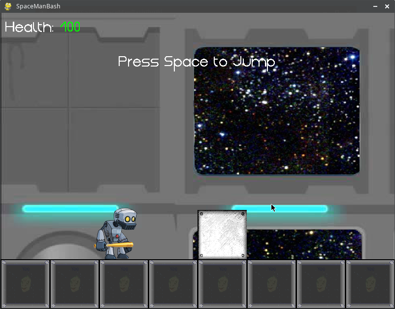
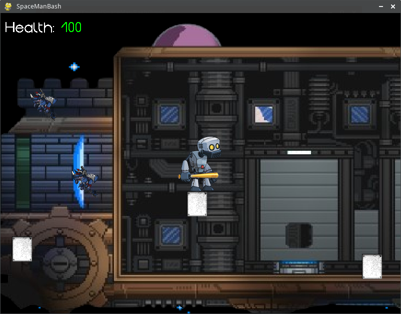

# SpaceManBash: Do Androids Dream of Bashing Electric Sheep?


Project Team: **Script Kitties**

[Rafael Zamora](https://github.com/rz4) - Game Engine

Zach Crossey - Levels

Karina Stestyuk - Characters

Last Updated: **April 2, 2017**

## Overview

SpaceManBash is a 2D Platformer with some combat elements.

This project was developed using Pygame for our CS498G Embedded Systems
course in order to learn more about the Python language.

## Game Features

SpaceManBash takes the player through 11 levels which will test their
platforming and hack&slashing skills. The player is tasked with reaching the
teleporter at the end of each level in order to progress through the game.

Some general features include:
- Modular Design
- Customizable Physics and Collisions
- Custom Level using JSON files
- Custom Level Scripts
- Some Custom Animations
- Music and Sounds
- Menu Systems
- Saving Game

For more information [click here](docs/SMBPowerPoint.pdf).

## ScreenShots







## Getting Started

#### Requirements:

> **Note:** Project contains an executable for Linux environments compiled with required packages.

Requires Python v3.5+.

Requires and the following Python Packages:

- [Pygame v1.9.3](https://www.pygame.org)
- [Pyganim v0.9.2](http://inventwithpython.com/pyganim/)
- [Numpy v1.12.1](http://www.numpy.org/)

#### Setup and Installation:

1. Download or clone repository.

2. Run SpaceManBash:

```

/SpaceManBash/src $python3 SpaceManBash.py

```

or

> **Note:** Executable for Linux Systems Only

```

/SpaceManBash/build $./SpaceManBash

```

## License
SpaceManBash is under the MIT License.
